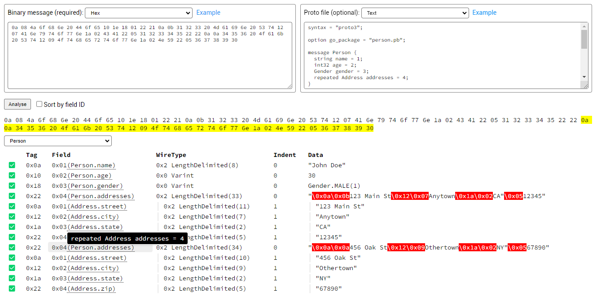

# Proto Message Helper

A protobuf message (binary) viewer tool which provides better output.

## Use the Playground

Follow these steps (it's easy!):

1. Open [the playground page](https://proto-message-helper.js.org/).
2. Upload or paste your binary message.
3. (Optional) If you have a `.proto` file, upload or paste it.
4. Click the "Analyse" button.
5. (Optional) If you've provided the `.proto` file, you can select a message type to let the viewer give a better output.
6. Enjoy the output.

## Features

### Multiple Input Methods

You can input all things by uploading a file, paste the hex string or base64 string.

### Display in Human-readable Format

This tool uses a table to display tags, field ids, wire types and the values of each fields in the given message.

It will try to recognise nested messages (even without the `.proto` file) and display them in a tree-like structure.

### Make Use of `.proto` File

If you provide a `.proto` file and specify the message type, the viewer will display field names and enum values. You can even hover over the field name to see the field's original definition.

# License

MIT
